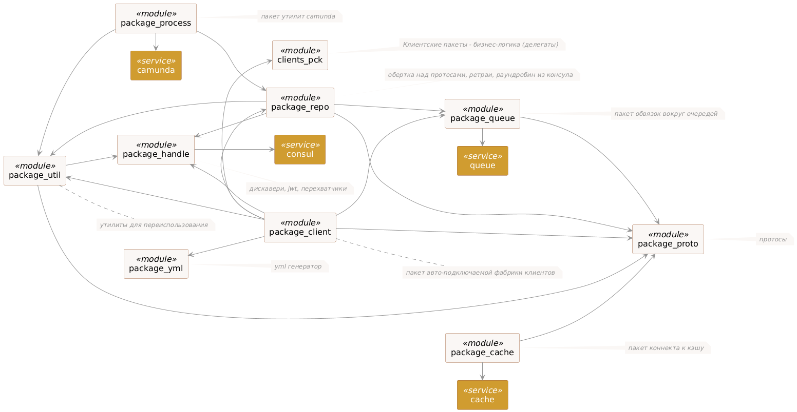
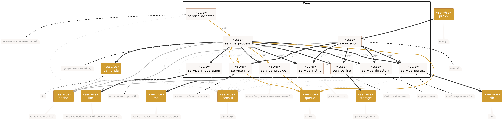
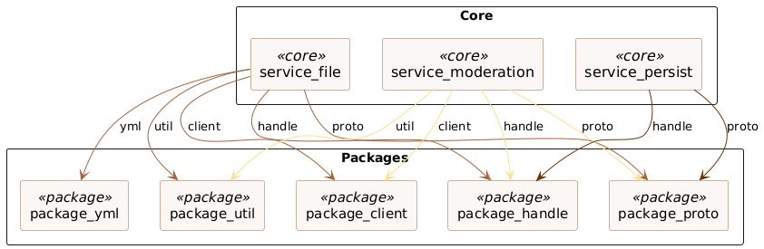
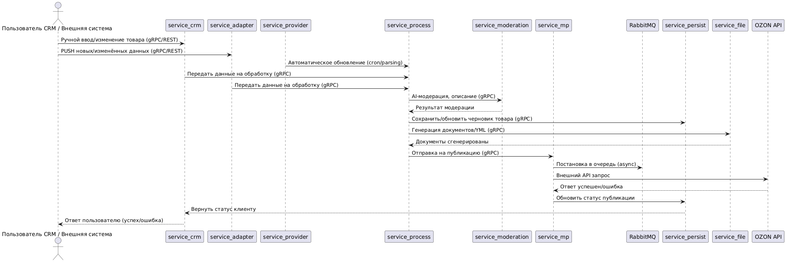
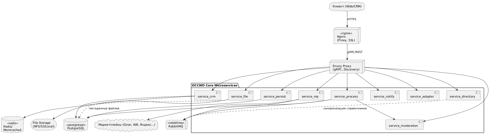

# OCCWO

## Архитектура
Проект OCCWO построен на микросервисной архитектуре.
Каждый сервис отвечает за свою бизнес-область и взаимодействует с другими сервисами через gRPC и очереди сообщений (RabbitMQ).
Вся инфраструктура построена с учетом высокой отказоустойчивости, масштабируемости и возможности гибкой доработки под нужды клиента.

### Взаимодействие
Все сервисы обмениваются данными через gRPC и асинхронные очереди, что позволяет реализовать как синхронные, так и асинхронные сценарии работы.

### Обеспечение устойчивости:
Для определения адресов сервисов используется Consul, что упрощает горизонтальное и вертикальное масштабирование, а также управление инфраструктурой.

### Логирование и аудит
Логирование всей бизнес-логики ведётся через Fluent, с возможностью централизованного аудита и ротации логов.

### Конфигурирование
Вся система управляется централизованно через общий шаблон конфигов, что облегчает внедрение новых клиентов.
OCCWO выступает как вендорское промежуточное ПО (middleware), обеспечивающее интеграцию между корпоративными системами клиента и российскими маркетплейсами (Озон, ВБ, Яндекс и др.).
Реализация позволяет гибко подключать новые модули, дорабатывать бизнес-логику под конкретного клиента и развертывать систему как на облаке, так и на ресурсах заказчика.

## Пакеты

### Описание
| Пакет           | Описание                                                    | Версия  |
|------------------|-------------------------------------------------------------|---------|
| package_repo     | обёртка над протосами, ретраи, раундробин из консула и т.д. | v0.1.1  |
| package_util     | утилиты                                                     | v0.1.1  |
| package_queue    | пакет обвязок вокруг очередей                               | v0.1.1  |
| package_cache    | пакет кэша                                                  | v0.1.1  |
| package_proto    | протосы                                                     | v0.1.1  |
| package_yml      | yml генератор                                               | v0.1.1  |
| package_handle   | дискавери, jwt и прочие обёртки                             | v0.1.1  |
| package_client   | пакет авто-подключаемой фабрики клиентов                    | v0.1.1  |
| package_process  | пакет утилит camunda                                        | v0.1.1  |
| clients_pck      | клиентские пакеты - бизнес-логика (делегаты)               | v0.1.1  |

## Ядро

### Описание
| Сервис             | Описание                                           |
|--------------------|----------------------------------------------------|
| service_crm        | сервис управления экосистемой                      |
| service_file       | сервис управления файлами                          |
| service_moderation | сервис интеграции с ИИ                             |
| service_mp         | сервис интеграции с маркетплейсами                 |
| service_persist    | CQRS                                               |
| service_process    | Camunda delegate worker                            |
| service_provider   | wrapper                                            |
| service_adapter    | API                                                |
| service_directory  | справочники маркетплейсов                          |
| service_notify     | сервис оповещений, алерта и мониторинга           |

## Связки

## Основные компоненты и технологии
- Proxy: Envoy для маршрутизации запросов между клиентом и микросервисами.
- Cache: Redis/Memcached для кэширования данных.
- Queue: RabbitMQ для взаимодействия между сервисами через топики.
- Process Engine: Camunda для выполнения бизнес-процессов.
- Database: PostgreSQL, размещённая в облаке, для хранения данных.
- Frontend: Angular проект, собранный в Docker контейнере и обслуживаемый Nginx.

### Взаимодействие клиентов:
- Клиенты обращаются к Nginx, который маршрутизирует запросы к соответствующим микросервисам (например, service_crm или service_web) через Envoy и gRPC.
- Основной поток данных направляется в service_persist для работы с базой данных.

---

# Описание микросервисов

### [service_process](https://github.com/occwo/service_process)
  Основной сервис для обработки сложных бизнес-процессов. Поддерживает следующие процессы:
  - Создание связок товаров между собой.
  - Отложенное создание сущности-связи с маркетплейсами (сохранение внешних ID и других данных).
  - Создание пакетов товаров (упаковка и quantity) для товаров, которые имеют соответствующие флаги от поставщика.
  - Создание новых товаров.
  - Обновление существующих товаров.
  - Алгоритм отложенной публикации данных на service_mp с использованием модели данных.
  - Циклический запуск процесса:
    + Сборка каталога для создания новых товаров.
    + Создание общих категорий и спецификаций товаров.
    + Генерация YML-выгрузок и общих документов.
    + Генерация индивидуальных документов для каждого товара.
  - Сбор и генерация отчётов, метрик, статистики и каналов взаимодействия между микросервисами.
  - Кэширование промежуточных результатов каждого делегата.

### [service_mp](https://github.com/occwo/service_mp)
  Обрабатывает взаимодействие с маркетплейсами:
  - Синхронизация данных о товарах и заказах.
  - Публикация данных из service_process через очереди RabbitMQ.
  - Сохранение чеков и документов через service_file.
  - Кэширование данных каждого товара.

### [service_crm](https://github.com/occwo/service_crm), service_web
  Отвечает за обработку клиентских данных:
  - Управление пользовательскими данными, заказами и историями взаимодействий.
  - Обработка пользовательских запросов.

### [service_file](https://github.com/occwo/service_file)
  Управление файлами:
  - Обработка файлов для хранения в облаке или локальном файловом хранилище.
  - Генерация документов и YML-выгрузок.

### [service_provider](https://github.com/occwo/service_provider)
  Работа с поставщиками:
  - Получение данных о товарах и их обновление.
  
### [service_adapter](https://github.com/occwo/service_adapter)
  Получение данных от поставщика или системы-источника:
  - Получение данных о товарах и их обновление.

### [service_persist](https://github.com/occwo/service_persist)
  Основной сервис для работы с базой данных (CQRS light).

### [service_notify](https://github.com/occwo/service_notify)
  Отправка уведомлений Telegram.

### [service_moderation](https://github.com/occwo/service_moderation)
  Модерация товаров через AI (Gemeni \ GPT):
  - Метод модерации товара по указанному промпту.
  - Метод создания описания товара из набора характеристик.
 
### [service_directory](https://github.com/occwo/service_directory)
  Автоматическая синхронизация данных справочников из маркетплейсов

---

# Масштабирование и слоистость

## Слои архитектуры

### Application Layer
service_crm, service_file, service_moderation, service_mp, service_process, service_notify
Бизнес-логика, оркестрация, обработка пользовательских запросов.

### Domain Layer
Бизнес-объекты, фабрики клиентов (package_client/clients_pck), мапперы, стратегии, делегаты, правила.

### Infrastructure Layer
Очереди (RabbitMQ), кэш (Redis/Memcached), Consul (discovery), Camunda, Envoy (proxy), Postgres.

### Data/Persistence Layer
service_persist, package_proto (protobuf, CQRS), база данных (Postgres), файловое хранилище.

### Integration Layer
service_adapter, интеграции с маркетплейсами, внешними API, сервисами провайдеров.

## Горизонтальное масштабирование

### Stateless сервисы
Все сервисы, кроме service_persist, реализованы stateless - легко масштабируются горизонтально через Consul/Envoy.
Просто поднимаются дополнительные инстансы, автоматом добавляются в пул через сервис-дискавери.

### Stateful сервисы
- service_persist (CQRS, БД) - кластеризация, репликация, failover через Postgres HA.
- Очереди (RabbitMQ) - HA кластеры (quorum queues), масштабирование за счёт горизонтальных воркеров.
- Кэш (Redis/Memcached) - master-replica, автоматический failover.

### Proxy/Ingress
Envoy/Nginx балансируют входящий трафик, маршрутизируют сервисы по namespace, health-check endpoints для управления доступностью.

## Устойчивость и failover

### Zero-downtime deploy
- Используется bgd (Envoy), feature-флаги, ручные переключатели на уровне ingress.
- Каждый сервис health-checked, дерегистрация/регистрация сервисов в Consul.
- В случае сбоя - автоматическое переключение на резервные инстансы.

## Retry / Fail-tolerant:
- Каждый consumer очереди и каждый API-воркер реализуют retry-логику (package_queue).
- Встроен CircuitBreaker для всех внешних интеграций и провайдеров.
- Panic mode (отдельный флаг) переводит систему в минимальный “read-only” режим.

## Бэкапы:
Все базы бэкапятся по расписанию, реализован Point-In-Time Recovery.
Файловое хранилище - либо S3-compatible, либо primary/backup схема - на усмотрение клиента и вида облака.

## Схематичное распределение ответственности по слоям
Application Layer -> Domain Layer (модели, мапперы, делегаты) -> Infrastructure Layer (очереди, кэш, discovery, proxy) -> Data/Persistence Layer (БД, storage, CQRS) -> Integration Layer (адаптеры, внешние API)

---

# Организация доступа между сервисами

## Внутренние gRPC-запросы между микросервисами защищены JWT-токенами:
Каждый сервис предъявляет подписанный токен, который валидируется через общий middleware (см. package_handle).
Авторизация по ролям, аудит всех действий.

## Передача административных привилегий
Все административные операции (создание пользователей, права доступа, управление ролями) проводятся через CRM-сервис и централизованную аутентификацию (JWT + RBAC).
Нет скрытых бэкдоров: доступы выдаются и отзываются централизованно, любой сервис проверяет права через CRM.

## Ротация ключей, токенов и секретов
- Ключи JWT ротаются при перезапуске/обновлении сервисов.
- Конфиги секретов передаются через централизованные шаблоны конфигов (см. package_proto.conf.Data).
- Vault не внедрён, но архитектура допускает интеграцию.

## Изоляция данных между клиентами
- Каждый клиент разворачивается в своём инстансе микросервиса.
- Данные клиентов физически и логически отделены - ни один клиент не может получить доступ к чужим данным (разделение через БД, storage и конфиги).
- При необходимости возможно внедрение multi-tenant режима (логическая изоляция на уровне схемы данных, но сейчас не используется - всё физически разнесено).

## Обновление и аудит
- Любые изменения ключей, токенов, ролей логируются (Fluent, централизованный аудит / ротация 2 недели).
- Все сервисы health-checked, любые подозрительные операции фиксируются и могут быть интегрированы с мониторингом.

---

# Управление конфигами и DevOps

## CI/CD и автоматизация деплоймента

### Автоматизация развертывания
Для всех микросервисов реализован собственный CI/CD пайплайн на базе self-hosted приложения, написанного на Go (в перспективе - интеграция с GitLab CI, GitHub Actions или Jenkins возможна по требованию клиента).
Авто-деплой каждого сервиса осуществляется через собственную систему доставки и раскатки обновлений.
Поддерживается пуш по тегу, авто-проверка сборки, автоматический билд docker-контейнеров.

### Среды и разделение окружений
Для каждого клиента разворачивается отдельный инстанс (single-tenant), с физически раздельной базой данных.
Окружения dev/prod/staging на ядре не заведены (из-за B2B-модели и вендорской схемы), но для каждого клиента или группы клиентов развёртывание стенда возможно по требованию, без архитектурных ограничений.

### Обновление и управление конфигами
- Все конфиги централизованы, шаблонизированы, хранятся в git-репозитории и версионируются.
- Переключение/обновление конфигов - только при перезапуске сервиса (hot-reload не реализован).
- Для отказоустойчивости используется blue-green deployment: новые версии выкатываются параллельно, затем переключение трафика (через Envoy/Nginx).
- Zero-downtime достигается только при наличии двух и более инстансов сервиса: один обновляется, другой обрабатывает трафик.

### Особенности
- Нет разделения среды внутри одной базы: каждая база - это один клиент (изолированный инстанс).
- Конфигуратор системы поддерживает миграции, проверку схем и валидацию при запуске.

---

# Обработка ошибок и устойчивость

## Fallback, Retries, Circuit Breaker
- Каждый сервис проектировался по принципу fail-tolerant: при сбоях внешних интеграций (API маркетплейсов, очередей, кэша) реализованы стандартные retry-механизмы (loop backoff).
- Для ключевых вызовов (например, внешние маркетплейсы или файл/база) - circuit breaker реализован на уровне кода (контроль ошибок подряд и “отключение” интеграции до восстановления, логирование и алерт).
- Если сообщение теряется в очереди - автоматическая догонка происходит на следующих итерациях.
- Потеря/отказ одного сервиса - система самостоятельно восстанавливает состояние через повторные прогоны.
- Реализация fallback’ов: повторяется через очередь (RabbitMQ) или повторный запрос к сервису.

## Мониторинг и логирование критики
- В ядре есть централизованное логирование (Fluent), аудит по каждому сервису.
- Мониторинг по запросу - возможна интеграция с Prometheus, ELK (под клиента).
- Алерты по фатальным событиям - через Telegram (service_notify).

## Panic Mode
- Отдельный режим аварийной работы не реализован.
- В случае фатала контейнер автоматически рестартится.
- Для failover - сервисы stateless, очередь и база гарантируют восстановление состояния.

---

# Документирование и Onboarding

## gRPC/Protobuf Reflection
- Все сервисы описаны через protobuf, что гарантирует строгую типизацию, обратную и прямую генерацию клиентов на любом языке (Go, Python, Java и др.).
- Reflection включен во всех сервисах: новый клиент может автоматически получать описание методов и моделей без ручного OpenAPI/Swagger.
- При необходимости возможна генерация REST-API шлюзов на основе gRPC-gateway (если требуется совместимость с системами без gRPC).

## BPMN схемы бизнес-процессов
- Для всех сложных процессов (workflow, синхронизация, модерация, публикация и тд) поддерживаются BPMN-схемы в Camunda - с подробными комментариями и визуализацией.
- Документация по процессам доступна для каждого клиента отдельно - легко внедрять/расширять логику без зависимости от ядра.

## Встроенная документация
- Критическая логика снабжена комментариями в коде.

---

#Расширяемость и платформенность

## Быстрое подключение новых клиентов
- Для добавления нового клиента достаточно создать отдельный пакет USERNAME (например, package_client/username), реализовать свою бизнес-логику, стратегии и мапперы.
- Подключение нового клиента в ядро занимает минимум времени:
  + достаточно зарегистрировать новый пакет-фабрику в package_client
  + прописать необходимые промпт-файлы в директории клиента для AI-модерации (service_moderation/USERNAME)
  + положить BPMN-схемы процессов в service_process/USERNAME
  + описать новые делегаты или кастомные шаги для уникальных бизнес-процессов клиента
- Весь код изолирован - ни один клиент не влияет на ядро или других клиентов.

## Гибкая архитектура для подключения внешних модулей
- Любой внешний сервис или модуль может быть интегрирован через gRPC (протобафы) или REST/HTTP (через шлюзы и адаптеры).
- Возможна организация webhook-интеграций, если клиенту требуется обратная связь от системы (например, события или триггеры).

## Изоляция и кастомизация
- Каждый клиент разворачивается на своём экземпляре - гарантированная изоляция данных и кастомизация под свои процессы и справочники.
- Изменения в ядре не ломают клиентов, а добавление новых функций/модулей не требует глобальных переделок - только регистрация и настройка нового пакета.

# Экономика инфраструктуры (TCO)

## Возможности по размещению
- Любой сценарий: on-premises (серверы клиента), в облаке (любая IaaS), гибридно (вынос базы или приложений на разные площадки).
- Масштабируемость: инфраструктура легко масштабируется - можно сразу рассчитать ресурсы под нужный объем данных и нагрузку.
- Расчет TCO: стоимость прозрачна, легко считать все расходы заранее - по серверу, по хранилищу, по лицензиям и доменам.

## Примечание
- Все тарифы - пример для базового развертывания (1 клиент, до 50–100 тыс. товаров в базе, без heavy-load).
- При росте нагрузки/бизнеса добавляются только новые инстансы или апгрейд серверов (например, добавление второго backend или replica БД).

## FAQ
- Облако - Да, разворачиваем в любом облаке, нужен только доступ или бюджет.
- Железки - Да, полностью поддерживается on-prem, даже без выхода в интернет (если нужны замкнутые контуры).

## Цены
| Ресурс                 | Цена/мес      | Характеристики                                    |
|------------------------|:-------------:|---------------------------------------------------|
| Frontend сервер        | **1 233 ₽**   | RAM 1 ГБ, 1 CPU, 10 ГБ HDD, Intel Xeon Gen2       |
| Backend сервер         | **2 860 ₽**   | RAM 4 ГБ, 2 CPU, 30 ГБ SSD, Intel Xeon Gen3       |
| Сервер БД (Postgres)   | **1 633 ₽**   | RAM 2 ГБ, 1 CPU, 20 ГБ SSD, Intel Xeon Gen2       |
| Файловое хранилище     | **720 ₽**     | 120 ГБ HDD, примонтировано на оба сервера         |
| Прокси (IP, в мес)     | **100 ₽**     | Выделенный IPv4                                   |
| Сертификаты SSL (год)  | **2 899 ₽**   | Средняя цена сертификата                          |
| Домен (год)            | **200–5 000 ₽**| В зависимости от выбранной зоны                   |

**Итого ежемесячно:** ~**6546 руб.** (без учета домена и сертификата - они разовые, ежегодные)

**Расчет - минимальный, один слой**

---

# Диаграммы

## Sequence
Сценарий: Обновление товара из CRM до публикации на маркетплейсах

## Deployment

---

> ARTYOM CHERKASOV (ACF FEKOZ) 2024-2025 | OCCWO

